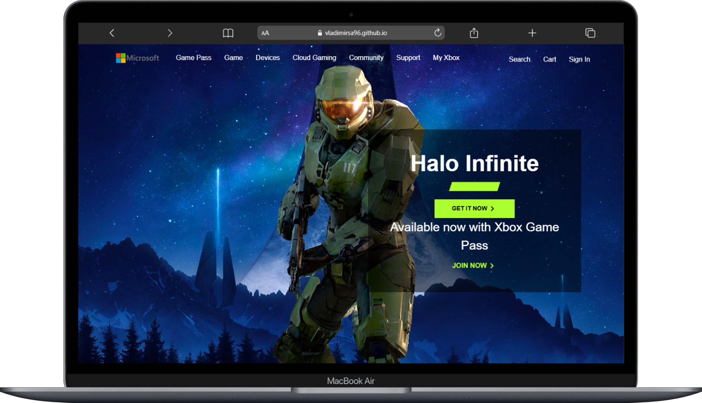
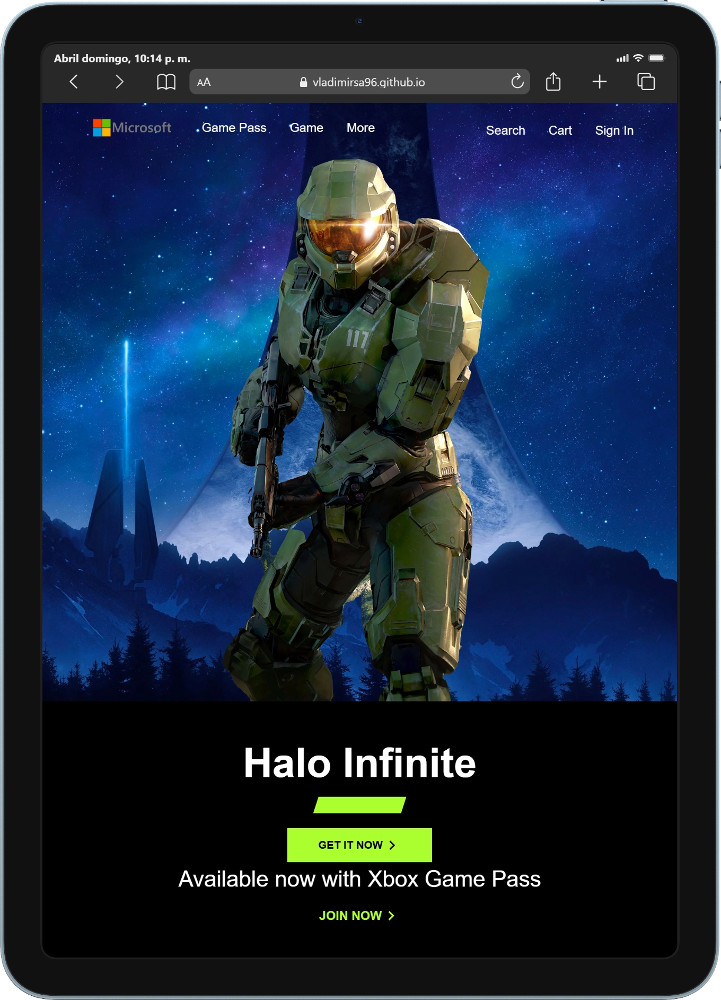
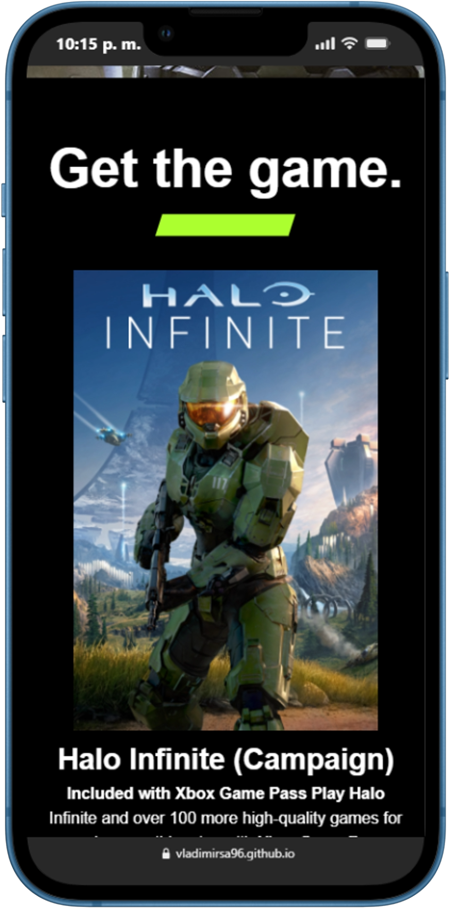

# 🎮 Halo Infinite — Website Clone

> Replica del sitio oficial de Halo Infinite (Microsoft Xbox), construida con HTML, CSS y JavaScript vanilla.

---

## 🔗 Demo en vivo

[](https://vladimirsa96.github.io/project-website-halo-microsoft/)

---

## 📸 Preview

<!-- Reemplaza con un screenshot real del proyecto -->


<br>


---

## 📋 Descripción

Clone del sitio web oficial de **Halo Infinite** de Microsoft Xbox. El proyecto replica la interfaz de usuario incluyendo navegación responsiva, sección hero, trailers, información del juego y opciones de compra.

---

## 🛠️ Tecnologías usadas


---

## ✨ Características

- ✅ Diseño responsivo (mobile, tablet, desktop)
- ✅ Navbar con menú hamburguesa para móviles
- ✅ Sección hero con CTA
- ✅ Sección de trailers y gameplay
- ✅ Sección de compra con precios
- ✅ Estilo fiel al sitio oficial de Xbox

---

## 🚀 Instalación y uso

```bash
# Clona el repositorio
git clone https://github.com/vladimirsa96/project-website-halo-microsoft.git

# Entra al directorio
cd project-website-halo-microsoft

# Abre index.html en tu navegador
open index.html
```

No requiere dependencias ni instalación de paquetes.

---

## 📁 Estructura del proyecto

```
project-website-halo-microsoft/
├── index.html
├── src/
│   ├── css/
│   ├── js/
│   └── img/
└── README.md
```

---

## 👤 Autor

**Vladimir Sanchez Astoray** — Frontend Developer

[](https://github.com/vladimirsa96)

---

## 📄 Licencia

Este proyecto es solo con fines educativos. Todos los derechos de Halo Infinite pertenecen a **Microsoft / 343 Industries**.

---

> 💡 *Proyecto desarrollado para práctica de maquetación y diseño responsivo.*